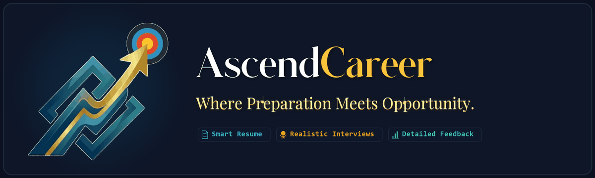
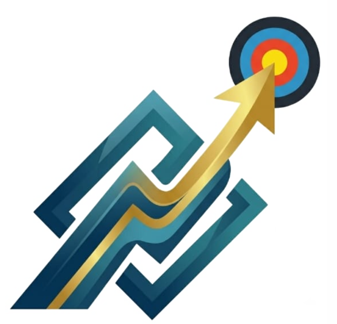

  

    

  

    
     
    
      
    <em>A comprehensive, AI-powered interview preparation and career-readiness platform with multi-persona panels, real-time voice-to-voice interaction, and deep role/company tailoring.</em>
  

  

    <a href="#-key-features">Key Features</a> •
    <a href="#1-resume-analysis--optimization">Resume Analysis</a> •
    <a href="#2-resume-builder--generation">Resume Builder</a> •
    <a href="#3-realistic-voice-to-voice-interview-environment">Voice AI</a> •
    <a href="#4-interview-panels--specialized-modes">Interview Panels</a> •
    <a href="#5-6-stage-progressive-ladder">Progressive Ladder</a> •
    <a href="#-tech-stack">Tech Stack</a>
  

---

## 🌟 Overview

**AscendCareer** is an intelligent, end-to-end career acceleration platform designed to empower job seekers at every stage of the hiring pipeline. It bridges the gap between raw candidate qualifications and competitive industry hiring standards through an integrated preparation ecosystem:

- **Intelligent Resume Suite**: Comprehensive AI-driven resume analysis, ATS optimization, and an accuracy-first resume builder equipped with a curated collection of industry-tailored, ATS-friendly templates.
- **Realistic Voice-to-Voice Interview Simulation**: Multi-persona interview panels, adaptive difficulty ladders, and deep role/company tailoring replicating the real-world pressure of live hiring rounds.

The platform follows a continuous **Audit → Optimize → Train → Re-practice → Verification → Placement Readiness** cycle to ensure candidates achieve measurable career growth.

---

## 🚀 Key Features

### 1. Resume Analysis & Optimization
A diagnostic and optimization engine that evaluates candidate resumes against real-world hiring criteria, job descriptions (JDs), and company-specific benchmarks:
- **Role & JD Alignment Scoring**: Generates multi-factor alignment scores (0–100%) measuring technical depth, experience relevance, and keyword synergy against target job roles and job descriptions.
- **Section-by-Section Intelligent Audit**:
  - **Already Correct**: Validates strong sections that already meet industry and ATS benchmarks.
  - **Needs Improvement**: Highlights vague phrasing, unquantified achievements, passive language, or unnecessary personal details with actionable rewrite advice.
  - **Missing Information**: Flags critical missing technical skills, missing project metrics, or omitted contact details required for the role.
- **Skill Gap & Keyword Intelligence**: Categorizes competencies into *Core Skills*, *Tools & Frameworks*, *Missing Role Requirements*, and *High-Impact Industry Keywords* directly extracted from target roles and job postings.
- **Action Verb & Phrasing Optimization**: Replaces weak, passive phrasing (*"assisted with", "worked on", "handled"*) with strong, impact-driven verbs (*"architected", "spearheaded", "engineered"*) using side-by-side before-and-after examples.
- **Project & Experience Relevance Scoring**: Assesses whether past projects and work history genuinely reflect the technical complexity and domain expectations of the target position.
- **Tailored Action Plan**: Delivers a step-by-step preparation roadmap detailing technical concepts to reinforce, behavioral talking points to prepare, and specific gaps to address prior to interviewing.

### 2. Resume Builder & Generation
A structured, professional resume creation suite calibrated for high-impact presentation and ATS compliance:
- **Strict Accuracy Rule (Zero Hallucination)**: Never fabricates fake credentials, invented work experience, or fictitious degrees. Focuses entirely on presenting the candidate's genuine background with optimal phrasing, structure, and professional clarity.
- **Comprehensive Profile Architecture**:
  - **Header & Professional Identity**: Full name, role-targeted headline, email, phone, location, LinkedIn, GitHub, and portfolio links.
  - **Structured Education & Academics**: Multi-entry tracking for degrees, institutions, boards/universities, start/end dates, current pursuit status, and CGPA/percentage scores.
  - **Work Experience & Projects**: Guided entry with real-time weak verb warnings and instant strong action verb recommendations.
  - **Professional Formal Finishing**: Includes formal declaration of accuracy, place and date stamps, flexible photo display (uploaded portrait, photo placeholder box, or none), and signature options (typed cursive, uploaded signature image, or blank line for physical signing).
  - **Dynamic Custom Sections**: Easily add custom categories for certifications, publications, honors & awards, volunteer leadership, and languages.
- **Curated, ATS-Friendly Professional Templates**:
  - **Classic**: Timeless, elegant serif layout ideal for corporate, finance, legal, and academic roles.
  - **Modern**: Sleek two-tone header bar with crisp typography, tailored for tech companies and startups.
  - **Minimal**: Clean, whitespace-optimized design maximizing reading efficiency and scanability.
  - **Professional**: Balanced, authoritative corporate grid layout for seasoned industry practitioners.
  - **Creative**: Vibrant accents and expressive styling for design, marketing, media, and product roles.
  - **Technical**: Skills-first layout emphasizing toolchains, system architectures, and technical projects.
  - **Executive**: Leadership-focused hierarchy prioritizing executive summaries, scope of impact, and metrics.
  - **Compact**: Space-optimized format designed to condense extensive experience into a clean single page.
  - **Nordic**: Understated Scandinavian aesthetic featuring subtle accent lines and modern minimalist typography.
  - **Ivy**: Prestigious, publication-grade layout inspired by top academic and research institutions.
- **Live Preview & Multi-Format Export**:
  - **Real-Time Interactive Preview**: Instant in-app visual rendering of the chosen template as changes are made.
  - **High-Quality ATS PDF Generation**: Pixel-perfect, downloadable vector PDF generated with custom styling via ReportLab.
  - **Clean Plain-Text Export**: Formatted plain text export ready for instant copy-pasting into applicant tracking systems.

### 3. Realistic Voice-to-Voice Interview Environment
- **Live Conversational AI**: Natural microphone input, intelligent speech recognition, context-aware reasoning, and spoken voice output.
- **Dynamic Follow-Ups**: Challenges incomplete answers, asks for rationale, and reacts naturally to candidate responses.
- **Two-Way Dialogue**: Candidates can ask questions back to the interviewers just like in actual interviews.

### 4. Interview Panels & Specialized Modes
- **Multi-Member Panel**:
  - **HR Interviewer**: Evaluates cultural fit, behavioral answers, and soft skills.
  - **Technical Interviewer**: Evaluates system architecture, coding depth, and problem-solving.
  - **Senior / Hiring Manager**: Assesses leadership, conflict resolution, and impact.
  - **Panel Lead**: Directs the flow and performs cross-examination.
- **Role-, Company- & Job Description-Targeted Interviews**:
  - **Target Job Role Adaptation**: Dynamically tailors technical depth, domain scenarios, and practical questions to the specific role chosen by the candidate (e.g., Software Engineer, Data Analyst, Cloud Architect, Systems Engineer, etc.).
  - **Company-Specific Hiring Benchmarks**: Replicates interview expectations, questioning styles, and cultural evaluations calibrated to the candidate's chosen company (e.g., Google, Amazon, Microsoft, high-growth startups, or enterprise organizations).
  - **Job Description (JD) Precision**: When a job description is provided, the AI extracts required technical competencies, tools, and responsibilities from the posting to conduct an authentic, role-aligned interview simulation.
- **Specialized Subject Interviews**: 1-on-1 deep-dives in programming languages and core domains (e.g., Python, C++, Java, SQL, Data Structures & Algorithms, System Design, and more).
- **Stress & Challenge Modes**:
  - **Resume Stress Testing**: Direct grilling on claims, projects, metrics, and tools mentioned in the candidate's resume.
  - **Interviewer Challenge Mode**: Tests candidate reasoning under skepticism.
  - **Unexpected Question Mode**: Evaluates handling of unfamiliar or curveball questions.
  - **Candidate Question Evaluation**: Grades the quality and impact of candidate questions at the end of the session.
  - **Last-Minute Prep Mode**: Rapid drill tailored to role, JD, and known weaknesses.

### 5. 6-Stage Progressive Ladder
- **Level 1**: Easy (Foundations & Icebreakers)
- **Level 2**: Moderate (Core Technical & Behavioral)
- **Level 3**: Moderate / Advanced (Complex Scenarios & Architecture)
- **Level 4**: Hard (Cross-domain & In-depth Problem Solving)
- **Level 5**: Very Hard (Stress Testing, Edge Cases & Executive Decision-Making)
- **Level 6**: Final Full Interview Simulation (Complete realistic panel simulation with real-world pressure)

### 6. Analytics & Personal Interview Memory
- **Interview Readiness Score**: Holistic index measuring candidate preparedness.
- **Granular Metrics**: Communication pace, pause patterns, technical depth, role alignment, and question completeness.
- **Personal Interview Memory**: Tracks recurring weaknesses across sessions and dynamically adapts future questions to verify improvement.
- **Detailed Replays**: Session transcripts with time-stamped moments of strength and weakness.

### 7. Career Artifacts & Verification
- **Verifiable Certificate of Completion**: Issued upon completing the 6-level ladder with a unique verification ID.
- **Readiness Reports**: Downloadable PDF reports detailing progress, mistakes, and recommendations.
- **Public Career Profile**: Shareable showcase link for LinkedIn and GitHub featuring verified readiness credentials and privacy controls.

---

## 🛠️ Tech Stack

- **Current Implementation**:
  - **Frontend & App Framework**: Streamlit
  - **Document & PDF Processing**: ReportLab, PyPDF2 / pdfplumber, Pillow, NumPy
  - **Modular Architecture**: Rule-based & heuristic resume analysis, versatile ATS-friendly layout engines, structured weak-verb database
- **Proposed Scaled Production Stack**:
  - **Frontend**: Next.js / React, Tailwind CSS, Web Audio API / WebRTC
  - **Backend / Services**: FastAPI / Python, Node.js
  - **Speech & Audio**: Real-time STT / TTS pipelines, Whisper / Cloud Voice APIs
  - **AI Core**: Context-aware LLM orchestration with structured evaluation & memory retention
  - **Database & Storage**: PostgreSQL / Vector DB for semantic memory & resume indexing

---

## 📄 License

This project is licensed under the MIT License - see the LICENSE file for details.
